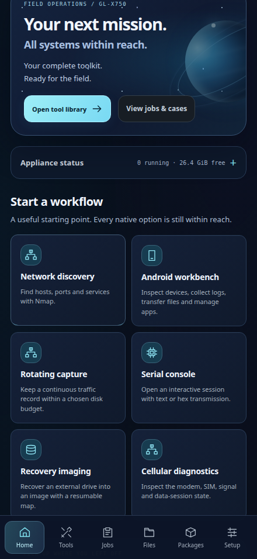
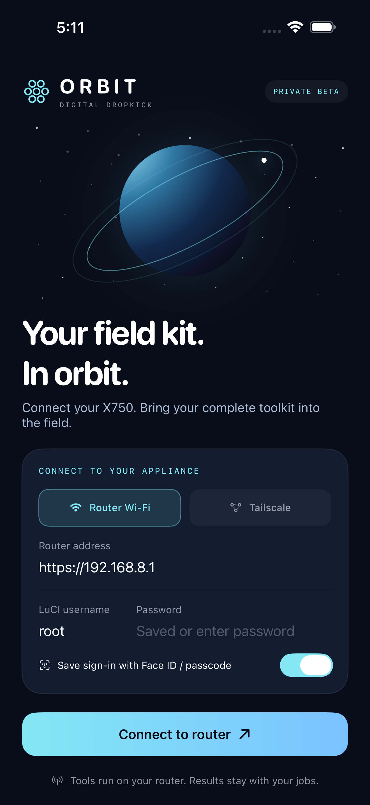
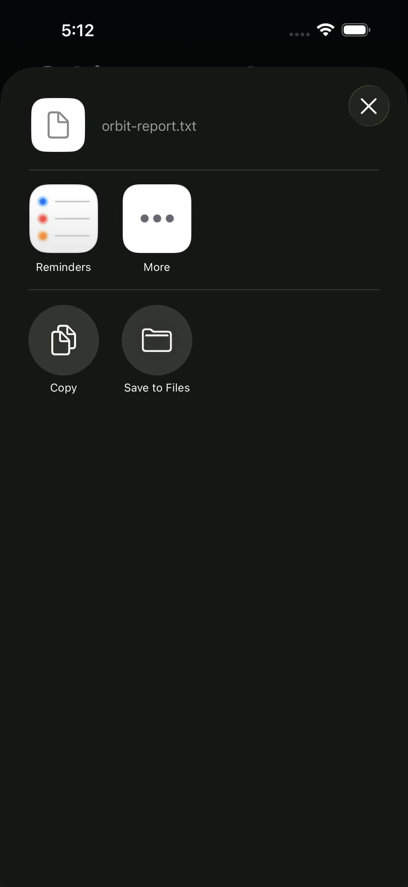

# Orbit companion beta

Router presentation: **4.1.0-beta.1**. Native companion: **0.1.0**, build **1**,
published in `feature/orbit-companion`. The unsigned iPhone IPA is ready for
private signing and installation.
Baseline: verified router/dashboard v4.0.1 at `be0cf24`.

## Use the phone preview

On the router Wi-Fi, open:

`http://192.168.8.1/cgi-bin/luci/admin/ddk/overview?orbit=1`

Through the configured Tailscale connection, open:

`http://100.122.115.85/cgi-bin/luci/admin/ddk/overview?orbit=1`

Sign in to LuCI. In Safari choose Share → Add to Home Screen → Open as Web App.
The icon launches the router workspace. This preview uses browser sign-in; it
does not include native Keychain/Face ID login. Session expiry requires signing
in again. Keep the phone connected to the router's Wi-Fi, or use Tailscale when
both devices have internet access. Local router tools work without an internet
uplink when the router can reach their target.



Orbit is opt-in. The ordinary `/ddk` dashboard keeps its default appearance.
Choose the connection badge and **Use dashboard appearance**, or append
`?orbit=0`, to leave Orbit in that browser session.

## What changed

- Space-inspired dark presentation using local CSS graphics, cyan controls and
  readable text. It adds no router service or runtime dependency.
- Persistent phone navigation covers all five pages and the input-file view.
- Network and Android workflows appear on the first phone screen. Appliance
  status expands without pushing the starting tools far down the page.
- Existing actions, schemas, confirmations, uploads, native output, cases,
  exports and next-tool handoffs are shared with the dashboard.
- Connection status follows real requests. Failed connectivity becomes visible;
  reconnecting does not automatically submit a tool action.
- Fields use 16px text in Orbit to avoid focus zoom on iPhone. Modal backgrounds
  include the companion header in focus isolation.
- A pre-existing navigation comparison was corrected so Files and Settings no
  longer appear selected simultaneously.
- Home Screen metadata and an original locally rendered Orbit icon are included.
  No service worker caches authenticated responses or tool requests.

## Validation

The existing local validation passed during implementation. The first real-router
browser preview checked five pages at 1440, 440, 390 and 320px; all 78 structured
forms; search/favorites; Android controls; and typed file handoffs. Real loopback
Nmap, continuous fping, stop/save/export, text/artifact download, file reuse and
inline upload passed. Test-created jobs and inputs were cleaned up.

Additional phone checks passed for status expansion, the connection dialog,
modal isolation, offline/reconnect behavior, readable input sizing and visible
starting workflows.

The committed router application from `d1f0808` was deployed and verified live:

- 62 installed application files match source SHA-256.
- Nine protected configuration files, 39 listeners and existing application
  data remain unchanged. GL.iNet, LuCI, Tailscale, extroot and swap are healthy.
- The full Orbit browser suite passed on the installed assets, without asset
  interception: 20 page/viewport checks, all 78 forms, the extra phone checks,
  and the real job/file/case workflows described above.
- The ordinary dashboard also passed all five pages at 1440, 390 and 320px.
- Transient browser sessions were destroyed and verification data cleaned up.

Local evidence: `/tmp/ddk-orbit-audit/release-local.log`, `browser-live.log`,
`browser-standard-layout.log`, `deploy.log`, and `final-router-audit.log`.

The native SwiftUI/WKWebView app passed its complete cloud suite on September
14, 2026: **11 unit/integration tests and two UI tests, zero failures**, using
Xcode 26.6 and an iPhone 17 Pro Max simulator running iOS 26.4. The same run
successfully built and packaged the Release arm64 iPhone app. Tested source:
`d7f5c06b23fabb9f5b834ab2502a8bb9475a0659`.
[Build, tests and downloadable artifacts](https://github.com/DigitalDropkick/x750v1/actions/runs/34808273128).

The tests cover unknown/changed certificate handling, an expired self-signed
certificate matching the router's trust model, LuCI-style sign-in redirects,
exact-origin redirects, bounded cookie transfer and disconnect cleanup.
The visible native app signs in, opens its workspace and presents the iOS share
sheet after actual taps on all four download paths: GET report, POST case
export, hidden-frame streamed artifact and browser-created report. Integration
checks verify the downloaded bytes, including a **17 MiB artifact by SHA-256**
and the router's existing browser-blob helper.

The downloaded IPA passed ZIP integrity, iPhoneOS/arm64 identity and checksum
checks. It contains the app and privacy manifest, with no test bundles or Apple
signing credentials. The cloud artifact `orbit-unsigned-iphone` is retained for
30 days; the laptop copy is `/home/astro/Downloads/Orbit-Beta/Orbit-unsigned.ipa`.
Its SHA-256 is:

`55193e3767ffe45d159d765e43b04b2d457fd80a74e258157973301a69b37510`





The share-sheet screenshot uses a synthetic test report; it is evidence of the
native file handoff, not a scan performed on a customer network.

The [iPhone installation guide](ORBIT-IPHONE-INSTALL.md) covers the prepared
Linux installer and both free and paid signing routes. Paid Apple membership
is optional for a private sideloaded beta. No Apple account has been entered,
membership purchased or physical iPhone installation performed. Simulator
checks do not establish real-device Face ID, iOS permissions, phone file
handling or physical peripheral compatibility.

## Router certificate identity

Public SHA-256 fingerprint of the **active port 443 HTTPS listener**, verified
over the existing authenticated router SSH connection and matched from the
laptop on September 14, 2026 UTC. Both Wi-Fi and Tailscale addresses serve it:

`6A:58:C8:3A:7B:74:7A:CD:31:CE:34:A7:BE:59:A6:BA:EA:70:77:F8:98:64:1C:32:B1:3B:3B:37:4C:5D:F6:83`

This is a public certificate fingerprint, not a password or private key.
It lets the operator verify the native app's first HTTPS pairing. Nginx serves
port 443 and forwards LuCI CGI requests; `/etc/uhttpd.crt` is a different internal certificate
and must not be used for this pairing. Read the active public certificate through
the trusted SSH connection when checking it again:

```sh
openssl s_client -connect 127.0.0.1:443 -servername 192.168.8.1 </dev/null 2>/dev/null |
  openssl x509 -noout -fingerprint -sha256 -dates
```

The current HTTPS certificate has a legacy April 2025 expiry. Orbit uses the
operator-verified exact certificate fingerprint as its local trust decision,
rather than public-CA validation. This does not renew or replace that certificate.
No router keys or HTTPS service configuration were changed. A later certificate
replacement will require pairing again. The HTTPS endpoint was also checked
from the laptop: unauthenticated requests return the expected LuCI sign-in form.

## Rollback

The normal installer backs up every replaced file and tracks new Orbit assets.
Use the printed backup directory with `rollback.sh` to restore v4.0.1 and remove
the newly installed assets. Saved cases and inputs remain on the router. Native
source and cloud-build preparation do not change router networking or services.

This deployment's rollback is:

```sh
DDK_TARGET=root@100.122.115.85 \
DDK_SSH_CONTROL_PATH=/run/user/1000/ddk-router-1000/control \
./rollback.sh /root/ddk-backups/20260914T012901Z-field-console-v4
```

## Remaining native steps

1. Connect the intended iPhone by USB and follow the installation guide. Apple
   sign-in, computer trust and Developer Mode prompts require the owner.
2. Verify real-device sign-in, Face ID/passcode, local and Tailscale routes,
   interrupted sessions, Files imports/exports and hardware workflows.
